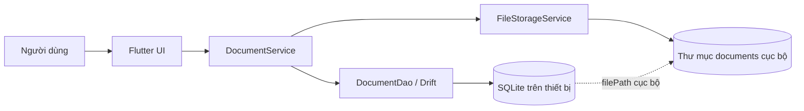
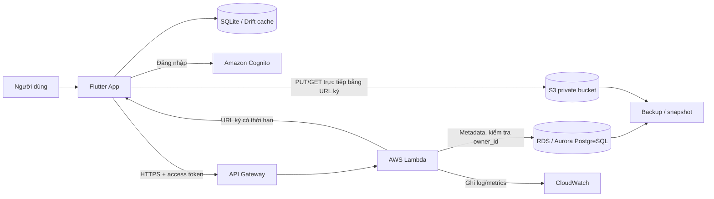
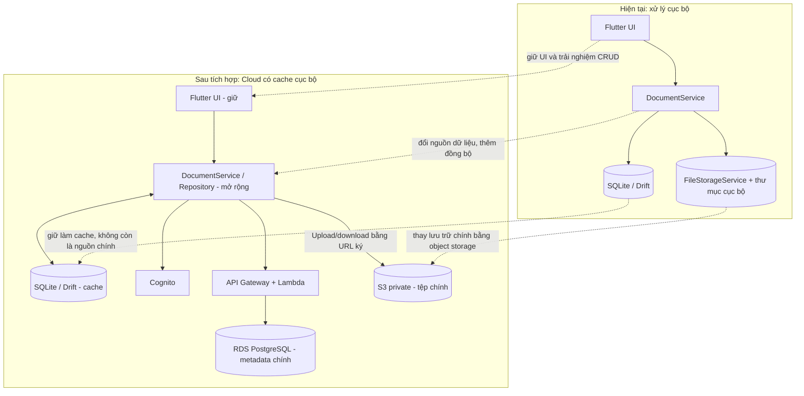
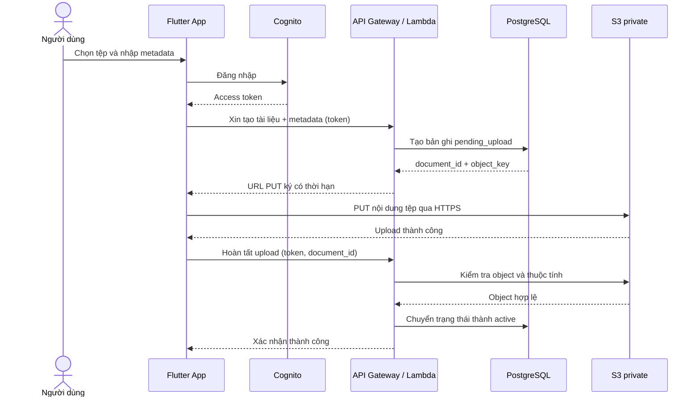
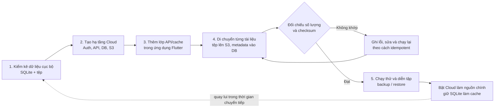

# Phân tích và phương án tích hợp Cloud cho Hệ thống Quản lý Tài liệu

## 1. Tóm tắt

Ứng dụng hiện tại là ứng dụng Flutter quản lý tài liệu học tập theo mô hình cục bộ. Giao diện và nghiệp vụ chạy trong ứng dụng; metadata được lưu bằng SQLite thông qua Drift, còn tệp được sao chép vào thư mục riêng của ứng dụng. Mã nguồn chưa có backend, xác thực người dùng, đồng bộ nhiều thiết bị hoặc dịch vụ lưu trữ Cloud.

Đề xuất triển khai theo **Public Cloud trên AWS**: ứng dụng Flutter gọi API có xác thực; metadata được lưu trong PostgreSQL được quản lý; nội dung tệp được lưu trong S3 private bucket. Ứng dụng tiếp tục dùng SQLite như cache và hàng đợi thao tác ngoại tuyến khi cần. Thiết kế này bổ sung truy cập từ xa và đồng bộ mà không đưa thông tin đăng nhập AWS hay quyền truy cập cơ sở dữ liệu vào ứng dụng.

## 2. Phạm vi và hiện trạng

Đánh giá này dựa trên mã nguồn trong thư mục `th1_cashew_document`. README của dự án mô tả ứng dụng CRUD chạy trên Windows, nhưng kiến trúc mã nguồn là ứng dụng cục bộ chứ không phải hệ thống máy chủ on-premise nhiều người dùng. Vì vậy, các hạn chế dưới đây được phân biệt giữa điều đã thấy trong mã và rủi ro sẽ phát sinh khi triển khai cho nhiều người dùng.

### 2.1 Các thành phần cốt lõi

| Thành phần | Hiện trạng quan sát được | Vai trò và nhận xét |
|---|---|---|
| Frontend | Flutter Material UI tại `lib/presentation/pages/` | Có màn hình danh sách/tìm kiếm, biểu mẫu thêm/sửa và chi tiết/xóa tài liệu. Form dùng `file_picker` để chọn tệp. Giao diện gọi `DocumentService`, chưa có luồng đăng nhập hoặc đồng bộ từ xa. |
| Application / nghiệp vụ | `DocumentService` tại `lib/application/document_service.dart` | Thực hiện CRUD metadata và gọi dịch vụ lưu tệp. Lớp này là ranh giới thích hợp để thay backend cục bộ bằng repository/API mà không buộc giao diện truy cập trực tiếp Cloud. |
| Data access | `DocumentDao` dùng Drift tại `lib/data/dao/document_dao.dart` | Truy vấn danh sách, theo ID, CRUD và tìm kiếm theo tiêu đề hoặc môn học. |
| Database | SQLite cục bộ qua `AppDatabase` tại `lib/data/database/app_database.dart`; bảng `Documents` tại `lib/data/database/tables/documents.dart` | Lưu `id`, `title`, `description`, `subject`, `type`, `filePath`, `createdAt`, `updatedAt`. Cơ sở dữ liệu nằm trong application support directory của thiết bị; không có đồng bộ giữa các bản cài đặt. |
| File storage | `FileStorageService` tại `lib/application/file_storage_service.dart` | Sao chép tệp vào thư mục `documents` trong application support directory và lưu đường dẫn cục bộ vào SQLite. Đường dẫn này chỉ có ý nghĩa trên thiết bị lưu tệp đó. |
| Backend / danh tính | Chưa có | Không có API server, quản lý danh tính người dùng hay phân quyền nhiều người dùng trong mã nguồn hiện tại. Đây là thành phần mới cần bổ sung để cho phép truy cập từ xa một cách an toàn. |

### 2.2 Luồng hoạt động hiện tại

1. Người dùng chọn tệp trên thiết bị trong `document_form_page.dart`.
2. `DocumentService.addDocument` yêu cầu `FileStorageService` sao chép tệp vào thư mục ứng dụng.
3. Đường dẫn cục bộ của tệp cùng metadata được ghi vào SQLite qua Drift.
4. Những lần đọc, tìm kiếm, sửa và xóa đều truy cập DAO cục bộ; khi xóa, ứng dụng xóa bản ghi rồi xóa tệp cục bộ.

Ở mô hình này, cả database lẫn tệp đều gắn với một thiết bị; không có thành phần trung tâm để đồng bộ.

## 3. Điểm nghẽn và hạn chế

### 3.1 Đã thể hiện trong ứng dụng

- **Không chia sẻ dữ liệu giữa thiết bị:** SQLite và tệp cùng nằm trên một thiết bị. Cài ứng dụng trên máy khác sẽ có một bộ dữ liệu độc lập.
- **Phụ thuộc vào thiết bị:** mất thiết bị, hỏng ổ đĩa hoặc gỡ ứng dụng có thể làm mất dữ liệu nếu chưa có cơ chế sao lưu bên ngoài.
- **Đường dẫn tệp không di động:** cột `filePath` lưu đường dẫn tuyệt đối của môi trường lưu trữ cục bộ; đường dẫn đó không thể dùng để tải tệp từ thiết bị khác.
- **Năng lực truy vấn có giới hạn:** tìm kiếm hiện tại dùng SQLite và chỉ so khớp tiêu đề/môn học; dữ liệu không được chia sẻ hoặc tìm kiếm tập trung.
- **Không có lớp xác thực/phân quyền:** hiện không có người dùng, quyền sở hữu tài liệu hay kiểm soát truy cập từ xa. Đây không phải lỗi với ứng dụng một người dùng cục bộ, nhưng là thiếu sót bắt buộc phải giải quyết khi đưa dữ liệu lên Cloud.

### 3.2 Hạn chế khi mở rộng theo mô hình máy chủ truyền thống

Đây là các rủi ro nếu xây dựng thêm máy chủ vật lý/on-premise quanh ứng dụng, không phải những thành phần đang có trong repository:

- Mua sắm và nâng cấp máy chủ, thiết bị lưu trữ, mạng và bản quyền tạo chi phí đầu tư ban đầu.
- Đội vận hành phải tự cấu hình mở rộng dung lượng, sao lưu, phục hồi sau sự cố, cập nhật bảo mật và giám sát.
- Khả năng phục vụ tăng đột biến bị giới hạn bởi năng lực máy chủ đã đầu tư; mở rộng thường cần thời gian và can thiệp thủ công.
- Truy cập từ Internet đòi hỏi thiết kế mạng, VPN/tường lửa, TLS và cơ chế bảo vệ máy chủ; một điểm lỗi tại trung tâm dữ liệu có thể ảnh hưởng toàn dịch vụ.
- Nếu dữ liệu vẫn gắn với đường dẫn cục bộ, đưa riêng metadata lên server chưa giải quyết được nhu cầu tải tệp từ xa.

## 4. Mô hình Cloud được chọn

### 4.1 Lựa chọn: Public Cloud AWS

Chọn **Public Cloud** vì ứng dụng chưa có hạ tầng máy chủ hoặc yêu cầu đã nêu về triển khai riêng biệt/on-premise. Dịch vụ quản lý của AWS giảm phần việc vận hành máy chủ và mở rộng dung lượng theo nhu cầu. SQLite trên thiết bị được giữ lại như cache cục bộ; nó không phải một private cloud, do đó kiến trúc mục tiêu vẫn là Public Cloud với ứng dụng hỗ trợ local cache.

| Nhu cầu | Dịch vụ đề xuất | Cách sử dụng |
|---|---|---|
| Xác thực | Amazon Cognito User Pools | Đăng nhập và cấp token cho ứng dụng. Không nhúng access key AWS vào ứng dụng. |
| API nghiệp vụ | Amazon API Gateway + AWS Lambda | Xác thực token, kiểm tra quyền sở hữu, xử lý metadata và cấp URL tải lên/tải xuống có thời hạn. |
| Lưu trữ tệp | Amazon S3 private bucket | Lưu nội dung tệp theo object key; bật mã hóa, chặn truy cập công khai và versioning khi phù hợp. |
| Metadata quan hệ | Amazon RDS for PostgreSQL hoặc Aurora PostgreSQL | Lưu metadata, user/owner ID, object key và trạng thái đồng bộ. Dùng RDS PostgreSQL cho khởi đầu đơn giản; chỉ chọn Aurora khi tải/nhu cầu mở rộng biện minh được chi phí. |
| Bí mật, khóa | AWS Secrets Manager và AWS KMS | Quản lý bí mật kết nối và khóa mã hóa; không lưu bí mật trong repository hoặc ứng dụng khách. |
| Theo dõi và kiểm toán | Amazon CloudWatch, AWS CloudTrail | Theo dõi lỗi/độ trễ và ghi nhận hoạt động quản trị, API theo chính sách lưu log. |
| Sao lưu | AWS Backup / snapshot RDS và chính sách S3 | Thiết lập lịch, thời gian lưu giữ và kiểm thử phục hồi; versioning không thay thế hoàn toàn backup. |

**Lưu ý địa lý:** cần xác nhận yêu cầu lưu trú dữ liệu trước khi chọn AWS Region. Singapore có thể là lựa chọn gần Việt Nam về độ trễ, nhưng dữ liệu vẫn được lưu ngoài Việt Nam. Nếu quy định hoặc hợp đồng bắt buộc lưu dữ liệu trong nước, phải đánh giá nhà cung cấp/Region đáp ứng điều kiện đó trước khi triển khai; không nên mặc định rằng Region gần nhất đáp ứng quy định.

## 5. Kiến trúc mục tiêu và luồng dữ liệu

Ứng dụng chỉ truy cập API nghiệp vụ và dùng URL ký ngắn hạn cho nội dung tệp. Nó không truy cập trực tiếp PostgreSQL và không có quyền IAM dài hạn. Backend kiểm tra danh tính và quyền sở hữu trước khi cấp URL.

### 5.1 Những thành phần được giữ lại, thay thế và bổ sung

| Thành phần hiện tại | Hướng xử lý |
|---|---|
| Flutter UI | Giữ lại; bổ sung trạng thái đăng nhập, online/offline và đồng bộ. |
| `DocumentService` | Giữ vai trò nghiệp vụ; gọi API/repository và điều phối cache thay vì thao tác duy nhất trên DAO cục bộ. |
| Drift / SQLite | Giữ làm cache và dữ liệu ngoại tuyến; đồng bộ với nguồn metadata Cloud. |
| `FileStorageService` | Thay hoặc mở rộng để tải lên/tải xuống S3 qua URL ký; không lưu URL ký như đường dẫn lâu dài. |
| Backend, xác thực, database Cloud | Thành phần mới; chịu trách nhiệm xác thực, phân quyền và lưu metadata dùng chung. |

### 5.2 Luồng tải tài liệu lên

1. Người dùng đăng nhập; ứng dụng nhận access token từ Cognito.
2. Ứng dụng gửi metadata (tiêu đề, môn học, loại, kích thước, loại MIME và checksum nếu có) tới API kèm token.
3. Lambda xác thực token, kiểm tra dữ liệu đầu vào và tạo `document_id`/object key ngẫu nhiên theo người dùng; không dùng tên tệp do người dùng cung cấp làm quyền truy cập. API tạo bản ghi metadata ở trạng thái `pending_upload` và trả URL S3 ký có thời hạn ngắn.
4. Ứng dụng tải bytes trực tiếp lên S3 qua HTTPS. Với tệp lớn, dùng multipart upload và hủy upload dở dang theo lifecycle policy.
5. Ứng dụng gọi API hoàn tất upload. Backend xác minh object tồn tại và các thuộc tính cần thiết, rồi chuyển bản ghi sang `active`. Có thể bổ sung quét mã độc trước khi đánh dấu tài liệu sẵn sàng tải.
6. Nếu quá trình tải hoặc hoàn tất thất bại, ghi nhận trạng thái lỗi và có quy trình dọn bản ghi/object mồ côi; không báo thành công trước khi metadata và tệp nhất quán.

Nếu upload hoặc bước hoàn tất thất bại, bản ghi chưa được coi là tài liệu sẵn sàng; backend cần hỗ trợ retry và dọn dữ liệu mồ côi.

### 5.3 Liệt kê, tìm kiếm và tải xuống

1. Ứng dụng gọi API danh sách/tìm kiếm kèm token và tham số phân trang.
2. Backend chỉ trả các bản ghi mà `owner_id` hoặc quyền chia sẻ được phép truy cập; không tin vào `owner_id` do client tự gửi.
3. Khi người dùng mở tệp, ứng dụng yêu cầu URL tải xuống. Backend kiểm tra quyền rồi trả URL ký GET có thời hạn ngắn; S3 phục vụ tệp trực tiếp.
4. Metadata có thể được lưu trong cache SQLite. Nếu chưa có kết nối, ứng dụng hiển thị dữ liệu cache và thông báo rõ thao tác nào đang chờ đồng bộ.

### 5.4 Sửa, xóa và đồng bộ

- Cập nhật metadata đi qua API và dùng version/`updated_at` để phát hiện ghi đè xung đột giữa nhiều thiết bị.
- Thay tệp cần một upload mới và cập nhật object key theo quy trình có trạng thái; chỉ xóa object cũ sau khi upload mới thành công.
- Xóa tài liệu nên đánh dấu xóa (soft delete) hoặc xóa theo quy trình bền vững: xác thực quyền, cập nhật metadata, xóa S3 object và thử lại/ghi nhận lỗi nếu một bước thất bại.
- SQLite trở thành cache/offline store thay vì nguồn dữ liệu chính. Cần định nghĩa chính sách đồng bộ và xung đột trước khi bật ghi ngoại tuyến nhiều thiết bị.

## 6. Thay đổi mô hình dữ liệu và triển khai

### 6.1 Metadata Cloud đề xuất

Giữ các trường nghiệp vụ hiện tại, đồng thời thay `filePath` cục bộ bằng định danh object:

| Trường | Mục đích |
|---|---|
| `document_id` | UUID do hệ thống tạo, ổn định giữa các thiết bị. |
| `owner_id` | Chủ sở hữu lấy từ danh tính đã xác thực; bắt buộc để phân quyền. |
| `title`, `description`, `subject`, `type` | Thông tin nghiệp vụ hiện tại. |
| `object_key` | Khóa nội bộ trỏ đến tệp trong S3; không phải URL công khai. |
| `original_filename`, `mime_type`, `size_bytes`, `checksum` | Thông tin phục vụ hiển thị, kiểm tra và giới hạn tải lên. |
| `status` | Ví dụ `pending_upload`, `active`, `pending_delete`, `failed`. |
| `created_at`, `updated_at`, `version` | Theo dõi thay đổi, đồng bộ và phát hiện xung đột. |

### 6.2 Các bước chuyển đổi

1. **Chuẩn bị:** xác định loại tệp/kích thước tối đa, số người dùng, mức truy cập, yêu cầu lưu trú dữ liệu, thời gian lưu backup và ngân sách.
2. **Xây backend và bảo mật:** tạo Cognito, API, cơ sở dữ liệu, bucket private, log, cảnh báo và backup; kiểm tra phân quyền bằng nhiều tài khoản.
3. **Tách lớp dữ liệu trong Flutter:** giữ hợp đồng `DocumentService` hoặc repository, rồi thêm implementation từ xa và SQLite cache. Thay kiểu đường dẫn trong model bằng object key/URL tải tạm; URL ký không lưu lâu dài trong SQLite.
4. **Di chuyển dữ liệu cũ:** đọc từng bản ghi SQLite, tải tệp cục bộ lên S3, tạo metadata dùng UUID và lưu bảng ánh xạ ID cũ-mới. Chỉ đánh dấu di chuyển thành công sau khi kiểm tra object/checksum; báo cáo lỗi để có thể chạy lại an toàn.
5. **Chạy thử và chuyển đổi:** thử trên nhóm dữ liệu nhỏ, so sánh số lượng/checksum, diễn tập phục hồi, rồi bật đồng bộ Cloud. Giữ bản cục bộ làm phương án quay lui trong thời gian chuyển tiếp theo chính sách đã thống nhất.

## 7. So sánh trước và sau

| Tiêu chí | Hiện tại / mô hình cục bộ truyền thống | Sau khi tích hợp Public Cloud |
|---|---|---|
| Lưu tệp | Tệp nằm trong thư mục ứng dụng của một thiết bị. | S3 private bucket; tải trực tiếp bằng URL ký ngắn hạn. |
| Metadata | SQLite cục bộ, mỗi bản cài đặt một cơ sở dữ liệu. | PostgreSQL dùng chung qua API; SQLite có thể giữ cache. |
| Truy cập từ xa | Không có đồng bộ/API; thiết bị khác không thấy dữ liệu. | Đăng nhập và gọi API qua HTTPS trên thiết bị có mạng. |
| Mở rộng | Bị giới hạn bởi dung lượng thiết bị; người dùng tự quản lý sao lưu. | Dung lượng object và dịch vụ quản lý có thể tăng theo nhu cầu; vẫn cần giới hạn/quota và giám sát chi phí. |
| Độ sẵn sàng | Phụ thuộc vào thiết bị và bản sao dữ liệu tại chỗ. | Dịch vụ managed giảm công việc vận hành; SLA, cấu hình đa AZ và backup cần được chọn/kiểm thử riêng. |
| Bảo mật | Chủ yếu dựa vào bảo vệ thiết bị; chưa có danh tính/phân quyền trong ứng dụng. | Cognito, kiểm tra quyền tại API, IAM least privilege, mã hóa và audit log; cấu hình sai vẫn có thể làm lộ dữ liệu. |
| Chi phí | Ít chi phí dịch vụ định kỳ; đổi lại chi phí lưu trữ, thiết bị và phục hồi do người dùng chịu. | Chi phí định kỳ theo DB, request, dung lượng, truyền dữ liệu, log, backup và hỗ trợ vận hành. |
| Ngoại tuyến | Có thể truy cập dữ liệu đã lưu cục bộ. | Có thể tiếp tục xem cache nếu thiết kế hỗ trợ; thao tác Cloud cần mạng hoặc phải xếp hàng đồng bộ. |

## 8. Đánh giá tác động

### 8.1 Bảo mật và quyền riêng tư

**Tác động tích cực**

- Bucket S3 không public; mã hóa khi lưu bằng SSE-KMS hoặc cấu hình mã hóa phù hợp và TLS khi truyền.
- Cognito xác thực người dùng; backend áp dụng phân quyền ở mọi thao tác theo `owner_id`/quyền chia sẻ.
- URL ký có thời hạn ngắn và chỉ cấp sau khi kiểm tra quyền; không ghi URL ký vào log hoặc lưu như URL lâu dài.
- IAM least privilege tách quyền Lambda, vận hành và người dùng; quản lý bí mật bằng Secrets Manager, không đưa AWS credentials vào Flutter.
- Bật audit log, cảnh báo truy cập bất thường, giới hạn tốc độ/kích thước tải lên và chính sách lưu/xóa dữ liệu.

**Rủi ro còn lại và biện pháp**

- Lỗi cấu hình bucket/IAM hoặc kiểm tra quyền thiếu sót có thể làm rò rỉ tài liệu: dùng block public access, kiểm thử truy cập chéo tài khoản và rà soát quyền định kỳ.
- File tải lên có thể chứa mã độc hoặc dữ liệu nhạy cảm: kiểm tra MIME/kích thước phía server, cân nhắc quét mã độc, không tin phần mở rộng do client gửi.
- Token hoặc URL ký bị lộ: thời hạn ngắn, không ghi log, lưu token trong kho bảo mật của hệ điều hành và hỗ trợ thu hồi phiên.
- Cần xác định Region, thời gian lưu, xử lý xóa tài khoản, khôi phục và yêu cầu pháp lý trước khi lưu dữ liệu thật.

### 8.2 Chi phí

Cloud chuyển một phần chi phí đầu tư và vận hành sang chi phí sử dụng định kỳ; không thể kết luận chắc chắn rẻ hơn nếu chưa có số liệu tải. Các khoản cần dự toán gồm:

- RDS/Aurora (dung lượng, cấu hình, thời gian chạy, Multi-AZ), backup/snapshot.
- S3 (dung lượng lưu, request PUT/GET, versioning và lifecycle).
- Lưu lượng tải xuống ra Internet; thường cần theo dõi kỹ nếu người dùng tải nhiều tệp lớn.
- API Gateway, Lambda, CloudWatch log/metrics, KMS và các dịch vụ bảo mật bổ sung.

Để kiểm soát: bắt đầu bằng cấu hình managed nhỏ phù hợp tải dự kiến, đặt AWS Budgets/cảnh báo, giới hạn kích thước/quota, lifecycle cho multipart upload và phiên bản cũ, đồng thời rà soát chi phí hàng tháng. Không bật Multi-AZ, CloudFront hoặc Aurora chỉ vì “có sẵn”; chỉ triển khai khi yêu cầu độ sẵn sàng/tải và phép đo chứng minh lợi ích.

### 8.3 Hiệu suất và độ sẵn sàng

- Tải nội dung trực tiếp từ ứng dụng lên S3 tránh chuyển toàn bộ bytes qua Lambda/API và giúp backend ít bị nghẽn bởi tệp lớn.
- Metadata qua API và DB dùng chung giúp nhiều thiết bị nhìn thấy cùng dữ liệu; cần phân trang, chỉ mục phù hợp và đo độ trễ truy vấn.
- Tải/xem tệp phụ thuộc mạng và độ trễ giữa người dùng với Region. Có thể đánh giá CloudFront cho phân phối nội dung riêng tư nếu tần suất tải lớn; phải cấu hình kiểm soát truy cập và cache phù hợp.
- SQLite cache có thể giúp mở danh sách đã đồng bộ khi ngoại tuyến nhưng cần cơ chế hết hạn cache, đồng bộ lại và xử lý xung đột.
- Managed service giảm công việc quản lý phần cứng, nhưng không tự đảm bảo khôi phục hoặc SLA mong muốn. Cần chọn cấu hình HA, backup và mục tiêu RPO/RTO theo yêu cầu thực tế, rồi diễn tập phục hồi.

## 9. Checklist nghiệm thu đề xuất

- [ ] Tạo được người dùng và đăng nhập; API từ chối token không hợp lệ/hết hạn.
- [ ] Người dùng A không thể liệt kê, tải, sửa hoặc xóa tài liệu của người dùng B bằng cách thay ID.
- [ ] S3 bucket không public; URL ký hết hạn; tệp không được phục vụ trước khi hoàn tất kiểm tra upload.
- [ ] Kiểm thử upload/download, tệp quá lớn, định dạng không hợp lệ, mất mạng giữa chừng và thử lại.
- [ ] Đối chiếu metadata, số lượng và checksum khi di chuyển dữ liệu từ SQLite/thư mục cũ.
- [ ] Kiểm thử backup và khôi phục cả PostgreSQL lẫn object trên S3.
- [ ] Có cảnh báo lỗi/chi phí, chính sách lưu/xóa dữ liệu và quy trình xử lý tài liệu mồ côi.
- [ ] Đo thời gian phản hồi API/tải tệp với bộ dữ liệu và kích thước tệp đại diện.

## 10. Kết luận

Với hiện trạng Flutter + Drift/SQLite + lưu tệp cục bộ, hướng phù hợp là bổ sung backend/API thay vì để ứng dụng kết nối thẳng tới Cloud database. AWS Public Cloud với Cognito, API Gateway/Lambda, S3 private và PostgreSQL managed đáp ứng được mục tiêu lưu trữ tập trung, bảo mật có kiểm soát và truy cập từ xa. SQLite có thể tiếp tục làm cache; việc đồng bộ ngoại tuyến, phân quyền, di chuyển tệp và lựa chọn Region cần được thiết kế/kiểm thử trước khi đưa dữ liệu thật lên Cloud.
